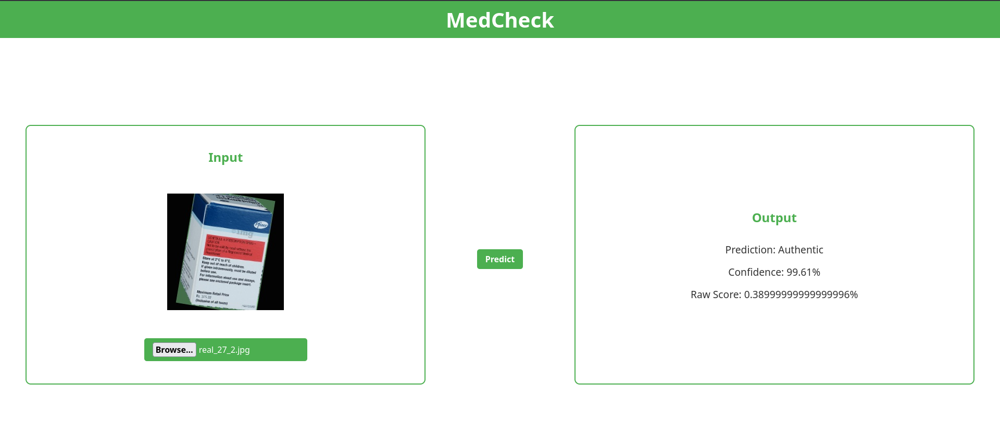
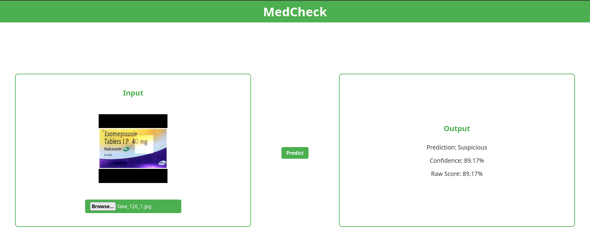

# 🩺 MedCheck – Pfizer Medicine Authenticity Detection

MedCheck is a machine learning–powered system designed to detect **counterfeit vs original Pfizer medicine packaging** using image classification.  
The goal is to assist in identifying potentially fake medicines and reduce risks in pharmaceutical supply chains.

---

## Examples

### Real Example

### Fake Example

---

### Classification Report

| Class        | Precision | Recall | F1-Score | Support |
|-------------|----------|--------|----------|---------|
| Original (0)| 0.93     | 0.84   | 0.88     | 195     |
| Counterfeit (1) | 0.73 | 0.87   | 0.79     | 98      |
| **Accuracy** |          |        | **0.85** | 293     |
| **Macro Avg** | 0.83   | 0.85   | 0.84     | 293     |
| **Weighted Avg** | 0.86 | 0.85  | 0.85     | 293     |

1. **Strong overall performance**  
   The model achieves **85% accuracy**, indicating it performs reliably on the dataset but still leaves room for improvement.

2. **Better at identifying original products**  
   Higher precision (0.93) for class 0 means the model is very accurate when labeling medicines as original.

3. **Good counterfeit detection (high recall)**  
   Recall of **0.87 for counterfeit (class 1)** shows the model successfully catches most fake products, which is critical for safety.

4. **Trade-off: more false positives on counterfeit**  
   Lower precision (0.73) for counterfeit indicates the model sometimes flags genuine products as fake.

5. **Balanced but slightly biased toward safety**  
   The model favors catching counterfeits over avoiding false alarms, which is generally the correct bias for a risk-sensitive application like this.

---

## Features

- 📷 **Image-Based Verification**  
  Upload an image of Pfizer medicine packaging to check authenticity.

- **Binary Classification Model**  
  Classifies packaging as:
  - Original
  - Counterfeit

- ⚡ **Fast Prediction API**  
  Backend optimized for quick inference.

- 🛡️ **Anti-Counterfeit Focus**  
  Detects subtle differences such as logo inconsistencies, print quality, layout variations, etc.

---

## 🏗️ Tech Stack

- **Frontend**: React.js, Javascript
- **Backend**: Flask
- **ML Framework**: TensorFlow
- **Model Type**: CNN (Convolutional Neural Network) with MobileNetV2

---